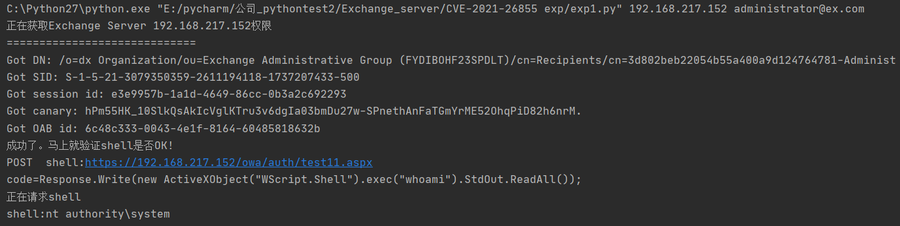

# CVE-2021-26855 Exchange RCE
影响版本：  
- Microsoft Exchange Server 2010
- Microsoft Exchange Server 2013
-  Microsoft Exchange Server 2016
- Microsoft Exchange Server 2019

exp：
[@o2oxy](https://www.o2oxy.cn/3169.html)

```
python exp.py 192.168.217.152 administrator@ex.com
```
