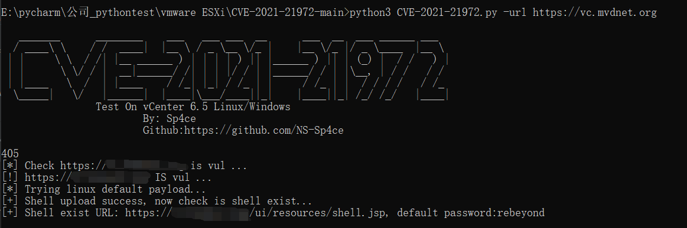

# CVE-2021-21972 VMware vCenter Server 未授权文件上传漏洞

影响版本：  
- VMware vCenter Server 7.0系列 < 7.0.U1c
- VMware vCenter Server 6.7系列 < 6.7.U3l
- VMware vCenter Server 6.5系列 < 6.5 U3n
- VMware ESXi 7.0系列 < ESXi70U1c-17325551
- VMware ESXi 6.7系列 < ESXi670-202102401-SG
- VMware ESXi 6.5系列 < ESXi650-202102101-SG


exp：
```
python3 CVE-2021-21972.py -url http://xx.xx.xx.xx
```

[@NS-Sp4ce](https://github.com/NS-Sp4ce/CVE-2021-21972)