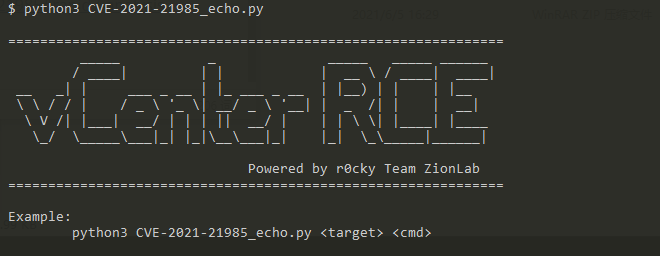

# CVE-2021-21985 VMware vCenter Server远程代码执行漏洞

影响版本：  
VMware:vCenter Server
- 非7.0 U2b版本的7.0版本
- 非6.7 U3n版本的6.7版本
- 非6.5 U3p版本的6.5版本

VMware:Cloud Foundation
- 低于4.2.1版本的4.x版本
- 低于3.10.2.1版本的3.x版本

exp：
```
python3 CVE-2021-21985_echo.py https://x.x.x.x <cmd>
```



[@r0ckysec](https://github.com/r0ckysec/CVE-2021-21985)